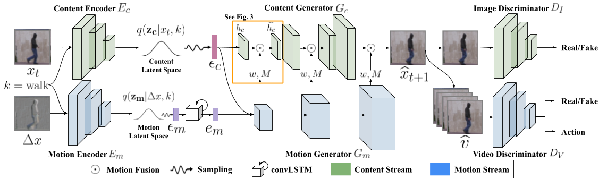

# TwoStreamVAN: Improving Motion Modeling in Video Generation (WACV 2020)

## Introduction


Video generation is an inherently challenging task, as it
requires modeling realistic temporal dynamics as well as
spatial content. Existing methods entangle the two intrinsically different tasks of motion and content creation in a
single generator network, but this approach struggles to simultaneously generate plausible motion and content. To improve motion modeling in video generation task, we propose a two-stream model that disentangles motion generation from content generation, called a Two-Stream Variational Adversarial Network (TwoStreamVAN). Given an action label and a noise vector, our model is able to create
clear and consistent motion, and thus yields photorealistic videos. The key idea is to progressively generate and
fuse multi-scale motion with its corresponding spatial content. Our model significantly outperforms existing methods
on the standard Weizmann Human Action, MUG Facial Expression and VoxCeleb datasets, as well as our new dataset
of diverse human actions with challenging and complex motion.

Here is [the link](https://arxiv.org/pdf/1812.01037.pdf) for our arxiv version. 

Welcome to cite our work if you find it is helpful to your research.
```
@inproceedings{sun2020twostreamvan,
  title={Twostreamvan: Improving motion modeling in video generation},
  author={Sun, Ximeng and Xu, Huijuan and Saenko, Kate},
  booktitle={Proceedings of the IEEE/CVF Winter Conference on Applications of Computer Vision},
  pages={2744--2753},
  year={2020}
}
```

##  Experiment Environment

Our implementation is in Pytorch. We train with Titan X.

We use `python3.6` and  please refer to [this link](https://docs.conda.io/projects/conda/en/latest/user-guide/tasks/manage-environments.html#creating-an-environment-with-commands) to create a `python3.6` conda environment.

Install the listed packages in the virual environment:
```
conda install pytorch torchvision cudatoolkit=10.2 -c pytorch
conda install -c anaconda pillow
conda install matplotlib
conda install -c menpo opencv
conda install -c conda-forge tqdm
conda install -c conda-forge glob2
conda install -c psi4/label/sprints abc
conda install -c anaconda numpy
conda install scikit-learn
conda install -c anaconda scipy
pip install tensorboardX
```

## Compiling the separable convolution module

The separable convolution module uses CUDA code that must be compiled before it can be used. To compile, start by activating the virtual environment described above. Then, set the `CUDA_HOME` environment variable as the path to your CUDA installation. For example, if your CUDA installation is at `/usr/local/cuda-8.0`, run this command:

```bash
export CUDA_HOME=/usr/local/cuda-8.0
```

Then, identify a virtual architecture that corresponds to your GPU from [this site](http://docs.nvidia.com/cuda/cuda-compiler-driver-nvcc/index.html#virtual-architecture-feature-list) (e.g. `compute_52` for Maxwell GPUs). Finally, to compile the CUDA code, run the install script with the virtual architecture as an argument, e.g.:

```bash
bash bashes/misc/install.bash compute_52
```


## Datasets
Please download  `Weizmann` [here](https://drive.google.com/file/d/1eZSlE4ulChi9jI8KTmNaOs23myDSfO2V/view?usp=sharing) 

Download  `MUG` [here](https://drive.google.com/file/d/1XamMtvkXpcLMPn1p1QhnkOYxmv-Vt707/view?usp=sharing).

Download `VoxCeleb` as instructed by its [Here](https://drive.google.com/file/d/18p5BZ7QptpXGvKie7ajxRHLUe_YEQYzC/view?usp=sharing).

Download 71x71 `npy` files of `SynAction` [here](https://drive.google.com/file/d/1QwFCQyHM8mmTKmrVJ9CVWuCUDT7M-2QJ/view?usp=sharing) and we also provide the full-resolution videos of `SynAction` [here](https://drive.google.com/drive/folders/1botq3NQlPaCo5Pez22k4sQ3qcqjDd7Uq?usp=sharing)


## Training
Please execute training bash files in the `bashes/TwoStreamVAN/` for the training, using the command, e.g.
```
bash bashes/TwoStreamVAN/MUGTrain.bash
```

To resume the training, use the following command, e.g. 

```
bash bashes/TwoStreamVAN/MUGTrain.bash --resume
```

## Test/Inference
Please execute evaluation bash files in the `bashes/TwoStreamVAN/` for the inference, using the command, e.g.
```
bash bashes/TwoStreamVAN/MUGEval.bash
```

## Note
If any link is invalid or any question, please email sunxm@bu.edu

## Acknowledgement
We would like to thank Simon Niklaus for providing code for the [Separable Adaptive Interpolation Network](https://github.com/sniklaus/pytorch-sepconv). We borrowed and refactored a large portion of his code in the implementation of our network.
